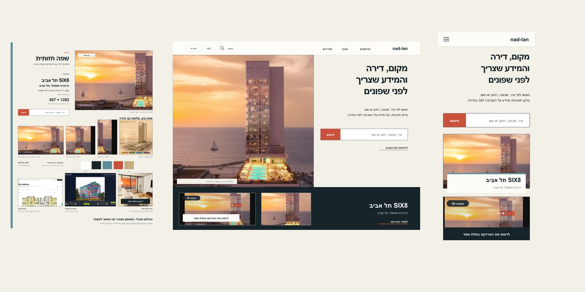

# Nad-Lan redesign directions

חבילת העבודה המלאה לכיוון העיצוב V2.1 של פורטל הנדל״ן Nad-Lan, כולל קובצי מקור, הוכחות רנדר, חומרי מחקר, תיעוד החלטות ותמלול השיחה הגלויה.

## תצוגה מהירה

- [לוח שפה V2.1](figma-language-board-v2-1.svg)
- [דף בית לדסקטופ V2.1](figma-home-desktop-v2-1.svg)
- [דף בית למובייל V2.1](figma-home-mobile-v2-1.svg)
- [הוכחת דסקטופ](outputs/final-proofs-v2-1/homepage-desktop-v2-1.png)
- [הוכחת מובייל](outputs/final-proofs-v2-1/homepage-mobile-v2-1.png)
- [הוכחת לוח שפה](outputs/final-proofs-v2-1/language-board-v2-1.png)

## מצב העבודה

- V2.1 הושלם כנקודת ביקורת לבעלים, אך לא סומן כאישור סופי.
- קובץ Figma שלא ניתן היה לפתוח לא שונה ולא הוצג כמתוקן.
- לא בוצעו שינויים באתר החי, ב-WordPress, ב-Figma או ב-Claude Design.
- בדסקטופ ובמובייל נעשה שימוש בנכס SIX8 האמיתי בלבד.
- תמונת ההדגמה משדה דב נשמרה בלוח השפה הפנימי בלבד ואינה מוצגת במסכי האתר.
- כרטיסי התלת-ממד הם שכבה קונספטואלית על גבי נכס SIX8 וכוללים קישור אחד למסך המלא הקיים.

## תיעוד

- [תמלול השיחה וההסברים](CHAT-TRANSCRIPT.md)
- [מסמך מסירה והחלטות](PROJECT-HANDOFF.md)
- [תיעוד עצירת Figma והמשך העיצוב](FIGMA-ACCESS-AND-DESIGN-HOLD.md)
- [ביקורת קופי וחזות](outputs/ari-figma-copy-visual-audit-2026-09-01.md)

## הערת פרטיות

התיעוד כולל את תוכן השיחה הגלוי למשתמש, סיכומי פעולות, החלטות ותוצאות. הוא אינו כולל הוראות מערכת נסתרות, שרשרת חשיבה פרטית, אסימוני גישה, פרטי אימות או סודות.
