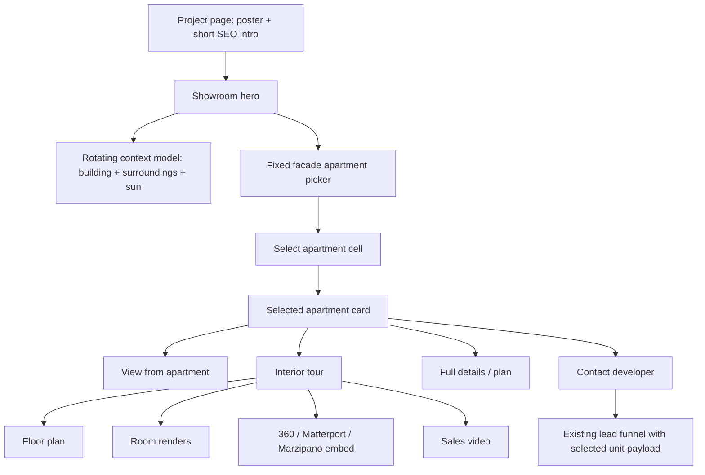

# Project Showroom Engine: Unit Selection To Interior Journey

Status: product contract for Rainbow, Dimri Yama, and future project pages.

## External Product References

- Homes.com + Matterport: 3D tour plus floor plan as a buyer journey, not a standalone gimmick. Reference: https://www.homes.com/solutions/matterport
- Matterport real estate: always-open interactive tour from any device. Reference: https://matterport.com/industries/real-estate
- Zillow 3D Home: listing media should connect the tour, floor plan, room context, and buyer actions. Reference: https://www.zillow.com/marketing/3d-home/
- model-viewer hotspots: official hotspot/annotation pattern for interactive 3D models. Reference: https://modelviewer.dev/examples/annotations/
- WCAG 2.2 target size: apartment targets and controls must stay comfortably tappable on mobile. Reference: https://www.w3.org/WAI/WCAG22/Understanding/target-size-minimum.html

## Product Rule

The showroom has three focus layers:

1. Context model: rotating 3D model for building, sun, sea/park/street context, and premium feel.
2. Apartment picker: fixed facade/elevation selector with apartment cells. This is where the buyer chooses a unit.
3. Interior journey: after selecting a unit, the buyer can step inside through floor plan, room media, 360 tour, video, and request-full-plan CTA.

The first two layers must work even when official BIM or Matterport assets are missing. The third layer may start with generated prototype media, but every prototype item must be marked as illustrative until contractor-approved assets arrive.

## Data Contract

Project-level fields:

- `project_model_glb`
- `project_model_poster`
- `project_3d_image`
- `project_3d_video_url`
- `project_3d_tour_url`
- `project_3d_drawings_json`
- `project_3d_environment_json`
- `project_3d_cesium_tiles_url`

Per-unit fields:

- `plan_url`
- `interior_url`
- `tour_url`
- `view_note`
- `price_estimate`
- `price_note`
- `status`
- `stage_x`, `stage_y`, `stage_w`, `stage_h`
- `hotspot_position`, `hotspot_normal`

## Buyer Journey Gate

When a buyer clicks an apartment, the page must answer:

1. Is this unit available?
2. What floor, rooms, sqm, direction, and view does it have?
3. What is the non-binding price context?
4. Can I see the view from this unit?
5. Can I step inside the apartment or see the floor plan?
6. Can I contact the developer with this exact unit attached?

## Contractor Journey Gate

A contractor or project manager must be able to update:

1. Model/poster/facade media.
2. Unit status and price estimate.
3. Unit floor plan, interior image, or tour URL.
4. Project video and environment cards.
5. Contact destination.

The contractor must not need new code for a normal project. A new project should be one asset folder plus one showroom payload.

## Prototype Rule

If official BIM, real inventory, real price list, Matterport tour, or official room renders are missing:

- generate or use original prototype media only;
- label it as illustrative;
- keep all prices as non-binding estimates;
- keep lead/purchase language as inquiry/check only;
- replace prototype assets when the contractor supplies official material.

## QA

For each project:

- desktop 1440 screenshot before unit click;
- desktop 1440 screenshot after unit click and interior panel open;
- tablet 768 screenshot;
- mobile 390 screenshot before and after unit click;
- no horizontal overflow;
- no selected-card overlap that hides the facade picker permanently;
- one H1;
- no project-name leakage from another project;
- no raw code or internal words in public copy.

