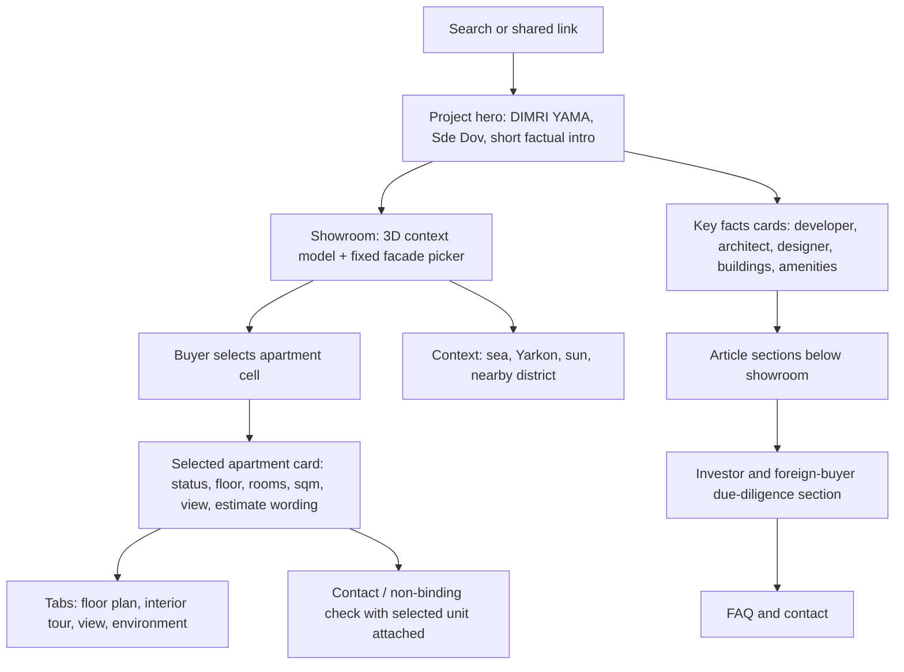

# Dimri Yama Content, SERP And Showroom Brief

Date: 2026-06-19
Status: internal build brief for the Dimri Yama showroom factory.

## Source Proof Used

| Source | URL | What It Proves | How We Use It |
|---|---|---|---|
| Dimri official project page | https://www.dimri.co.il/dimriyama-2/ | DIMRI YAMA / YAMA TLV positioning, sea/Yarkon context, four buildings, 9-39 floors, amenities, Rani Ziss Architects, Kelly Hoppen CBE | Public project facts, designer/architect section, amenity cards |
| Sde Dov project page | https://sdedov.co.il/project/dimri-yama/ | Building plan categories: A 2/3/4 rooms, B 2/3/5 rooms, C 2/3/4 rooms, D studio/2/3 rooms | Prototype apartment-cell taxonomy until official inventory arrives |
| Zillow 3D Home | https://www.zillow.com/3d-home/ | 3D tours and interactive floor plans help buyers understand layout and media context | Interior/floor-plan/tour slots per selected apartment |
| Homes.com Matterport | https://www.homes.com/solutions/matterport | Matterport-style tours are a real buyer confidence pattern, not decoration | "Tour inside apartment" CMS field and future media slot |
| model-viewer annotations | https://modelviewer.dev/examples/annotations/ | Hotspots are possible on 3D models when real model coordinates exist | Keep 3D context hotspots for environment; apartment picking stays on facade until apartment-level GLB exists |
| Chrome DevTools Device Mode | https://developer.chrome.com/docs/devtools/device-mode/ | Device-size rendering checks | Required 1440/768/390 QA |
| Lighthouse | https://developer.chrome.com/docs/lighthouse/overview/ | Performance, accessibility, SEO checks | Required before public publish |
| WAVE accessibility tool | https://wave.webaim.org/ | External accessibility visual check | Required before public publish |

## Search Intent Clusters

### Hebrew Primary

- דמרי ימה
- דמרי YAMA
- דמרי ימה שדה דב
- דירות בדמרי ימה
- דירות למכירה בדמרי ימה
- דמרי ימה מחירים
- דירות חדשות בשדה דב
- פרויקטים חדשים בשדה דב
- דירות ליד הים בתל אביב

### Hebrew Support

- רובע שדה דב
- דירות יוקרה בשדה דב
- דירה עם נוף לים בתל אביב
- דירות חדשות ליד פארק הירקון
- פרויקט דמרי תל אביב
- קלי הופן דמרי ימה
- רני זיס דמרי ימה

### Foreign Buyer Clusters

- English: Dimri Yama Tel Aviv, Sde Dov new development, new apartments by the sea Tel Aviv.
- French: projet Dimri Yama Sde Dov, appartement neuf Tel Aviv, investissement immobilier Tel Aviv.
- Russian: Dimri Yama Sde Dov, новые квартиры в Тель-Авиве, недвижимость у моря в Тель-Авиве.
- Arabic: مشروع ديمري ياما في سدي دوف, شقق جديدة في تل أبيب, شراء شقة قرب البحر.

## Competitor Gap

| Page Type | What They Usually Do Well | Gap NadLan Should Win |
|---|---|---|
| Developer page | Beautiful official branding, project facts, sales tone | Little independent comparison, no buyer-side due-diligence flow, no selected-unit context |
| District/project directory page | Lists projects and plan categories | Usually shallow content and no apartment-selection journey |
| Portal/listing page | Search and comparison behavior | Often not enough project-specific architecture, media, or official source explanation |
| 3D-tour platforms | Strong tour/floor-plan UX | Not integrated with local Hebrew buyer questions, price wording, Sde Dov context, and contact flow |

## Page Hierarchy

## Above-The-Fold Copy Direction

The first public text must start with the project, not with the technology.

Draft Hebrew opening:

> דמרי ימה בשדה דב הוא פרויקט מגורים חדש של דמרי בין חוף תל אביב לפארק הירקון, עם ארבעה בניינים, דירות בגדלים שונים ומתחם שירותים רחב. בחרו דירה על חזית הפרויקט, בדקו כיוון, קומה ומידע ראשוני, ואז שלחו פנייה לא מחייבת.

This is intentionally short so the showroom remains close to the top.

## Content Blocks Required Before Publish

1. Buyer summary: what the project is and why Sde Dov matters.
2. Apartment selection guide: explain the facade cells and status colors.
3. Project facts table: developer, location, buildings, floors, architect, designer, amenities.
4. Location context: sea, Yarkon Park, district plan, access, future surroundings.
5. Architecture and design: Rani Ziss Architects, Kelly Hoppen CBE, wave-like western facade.
6. Amenities: pools, spa, gym, work/library spaces, children/family spaces.
7. Investor checks: price wording, delivery assumptions, district risk, documents to verify.
8. Foreign-buyer note: what non-Israeli buyers should verify before purchase.
9. FAQ: availability, price estimate, plans, view, contact, official materials.

## CMS/Data Requirements

Project-level:

- poster image
- GLB context model
- facade/elevation picker
- floor-plan media list
- interior-tour URL
- sales video URL
- environment/context pins
- price source note
- contractor phone/WhatsApp/email
- language status per locale

Unit-level:

- building
- floor
- rooms
- sqm
- balcony
- direction/view
- status
- price wording or estimate
- plan URL
- tour URL
- facade cell coordinates
- selected-unit CTA text

## Buyer Journey Gate

A buyer must be able to:

1. understand the project in the first 10 seconds;
2. see 3D context without losing the facade picker;
3. choose a clear apartment cell;
4. see apartment facts without the panel blocking the whole selector;
5. open plan/tour/view tabs;
6. send a contact request with unit context;
7. return to the selector and choose another unit.

## Contractor Journey Gate

A contractor/operator must be able to:

1. replace assets without editing PHP;
2. update availability and status;
3. update price wording only after approval;
4. attach floor plans, tours, and video;
5. see that inquiries include unit context;
6. understand that the page is a premium digital sales center.

## External QA Tools

These are the minimum proof tools for the publish gate:

- Chrome DevTools Device Mode: 1440, 768, 390, Edge mobile UA.
- Lighthouse: performance, accessibility, SEO, best-practice scan.
- WAVE: visual accessibility scan and form/contrast checks.
- WordPress REST preview: verify draft content is not escaped.
- Live healthcheck: required only if plugin behavior changes.

## Do Not Publish Until These Are True

- No horizontal overflow at 390 px.
- The model does not show the underside when dragged.
- The facade and model remain close together on mobile.
- The selected apartment panel has a dismiss path and does not block all cells.
- No internal public-language leaks.
- No copied official image or paid-source data without approval.
- Real prices/inventory are owner/developer approved or clearly marked as illustrative estimate.

