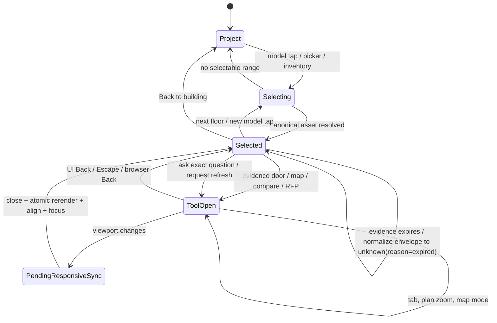
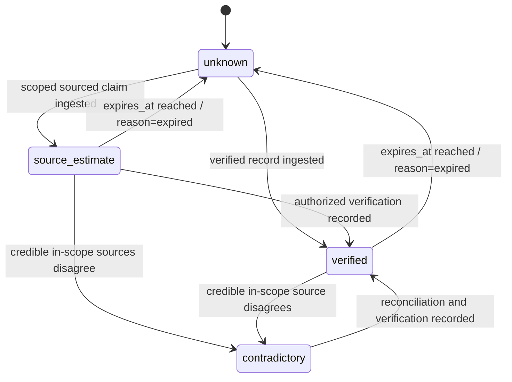
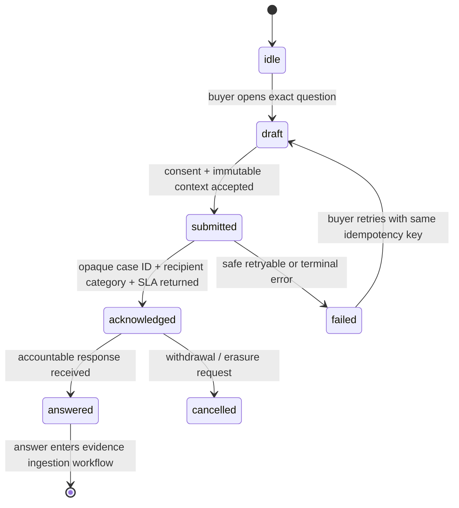

# Decision-surface state machine

**Proposal only — not applied.**

## Invariants

- The immutable browser/content tuple `project_contract_id + building_id + tower_id + floor_id (+ suite_id)` is the single source of truth for model, URL, summary, tools, compare and lead payload; neither a translated label nor a project-global floor number may substitute for it. The separate numeric WordPress post/routing ID (`wp_post_id` in project data; `project_id` on the RFP wire) is carried for server lookup but never defines browser identity.
- A responsive rerender never duplicates selected-screen or dialog IDs.
- A tool is a direct `body` child and never lives below a transformed ancestor.
- Resize/orientation while a tool is open is deferred; the underlying selected subtree is replaced atomically only on close.
- A transition class cannot prevent focus resolution; focus occurs after the replacement trigger is visible.
- Scroll alignment temporarily neutralizes global smooth scrolling.
- History markers contain the complete compound identity. A stale Forward marker for another building, tower, floor or suite is discarded rather than overlaying old content.
- One render lifecycle owns one resize/scroll listener; use `AbortController` to tear down listeners.
- No `MutationObserver` writes the attribute it observes.

## Canonical evidence-state transition

The persisted enum is exactly `unknown | source_estimate | verified | contradictory`. “Reported” and “estimated” are buyer-facing labels for scoped `source_estimate`; “conflicting” displays `contradictory`; “stale” is derived from expiry and becomes `unknown` with `reason=expired`. No transition to a positive availability claim occurs without evidence ingestion and authorized validation.

## Separate request/case lifecycle

`requested`, `submitted` and `answered` are case states, never `evidence.state` values. An answer changes evidence only after the appropriate source, scope, owner, verification and expiry checks run.
