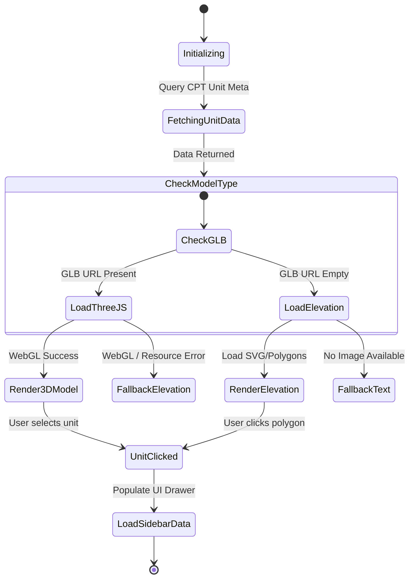

# NadLan (נדל״ן חכם) — Master Website Specification & War Room Plan

**Date:** June 21, 2026  
**Scope:** Design System, UI/UX Specs, Page Architecture, Anti-Cannibalization Keyword Registry, 3D Project Showroom, Listings Engine, Monetization Model, and Phased Backlog.  
**Operating Mode:** Planning Mode (awaiting user approval before execution).

---

## User Review Required

> [!IMPORTANT]
> The owner must review and approve this master specification before any product code changes are implemented in the repository or deployed to the WordPress server.

> [!WARNING]
> All strategic actions must align with the **No-Compromise Mandate** (we do not avoid high-competition money keywords because of competitor strength) and the **Anti-Cannibalization Governance System** (every page must own exactly one canonical keyword cluster).

---

## Open Questions for the Owner

1. **Mapbox & Matterport Licensing:** Do we have active Mapbox API tokens and official Matterport tour iframe URLs for the Dimri Yama and Rainbow Sde Dov projects, or should we initialize them in their respective concept fallback states first?
2. **Morning (Green Invoice) API Credentials:** For the PMPro + Morning recurring billing automation, can we store the API keys in WordPress secure option fields instead of the codebase to maintain repo security?
3. **Legal Wording Approvals:** Do you have the official attorney-approved disclaimers for the appraisal tool (`/property-value-estimator`) and the developer project details, or should we draft standard compliant disclaimers for legal review?

---

## 1. UI/UX Design System & Visual Mockups

The website design uses a premium, high-tech, and luxurious aesthetic tailored for the Israeli real estate market. The typography consists of **Heebo** (primary clean sans-serif for numbers, listings, and filters) and **Frank Ruhl Libre** (premium serif for article headings and trust statements). The color palette is composed of:
- **Warm Ink (Dark):** `#0e1111` (primary background and brand container color)
- **Cream (Light):** `#f9f6f0` (primary text, paper containers, and highlights)
- **Gold (Luxury):** `#c5a059` (brand accent, active borders, call-to-actions, and premium pins)
- **Mint Green (Trust):** `#4caf50` (verified tags, active unit status, and positive signals)

### 1.1 Homepage Layout & Aesthetics

The homepage transitions from a simple brochure landing page into a dense, data-driven portal dashboard. It features a prominent hero search bar, direct hubs to the various real estate categories, interactive tool widgets, and verified professional panels.


* **Hero Area:** Centered Hebrew search input: `חפש דירה, פרויקט או בעל מקצוע`. High-contrast gold input borders on focus.
* **Portal Index:** Grid of categories with count badges: listings for sale, listings for rent, new projects, calculators, and legal/valuation services.
* **Calculator Snippet:** A mini mortgage calculator slider that computes monthly payments in real-time, driving users to the full `/mortgage-calculator` page.
* **Trust Badges:** Official trust seals (`מאומת`, `רשמי`, `ליווי משפטי`) clearly displayed to build public confidence.

---

### 1.2 Property Listings Search (Split Screen Map/List)

Designed for modern portal utility, this screen splits the desktop view into a live Mapbox interface (left 50%) and a dense scrollable catalog card list (right 50%).


* **Sticky Filter Bar:** Top horizontal bar containing dropdown controls for city, neighborhood, price limits, rooms, property type, and specific attributes (balcony, elevator, Mamad).
* **Interactive Map:** Customized Mapbox GL layer with gold pricing bubbles (e.g., `₪3.2M`). Clicking a bubble highlights the respective card on the right.
* **Dense Cards:** Properties are displayed in high-density cards containing property photo, large gold price, exact square meters (sqm), room counts, and badges like `בלעדי` (exclusive) or `חדש` (new).
* **Mobile Docking:** On screens below 768px, the map is hidden behind a floating floating action button (`מפה / רשימה`), and cards stack cleanly with 44px minimum touch targets.

---

### 1.3 3D Project Showroom (Dimri Yama / Sde Dov)

The flagship interface for new construction projects, presenting an interactive sales experience with no fake data.


* **Interactive Center Area:** Displays a WebGL 3D model (GLB format via Three.js/Model-Viewer) or a high-res elevation blueprint mapped with vector polygons.
* **Unit Selector Sidebar:** Clicking a level or specific unit coordinates updates the right-side sidebar with real-time JSON unit data: floor number, room count, sqm size, balcony size, direction (e.g., `מערב - נוף לים`), status (`פנוי` in green, `בתהליך` in orange, or `נמכר` in red), and the estimated price range.
* **Tab Controls:** Bottom toggle bar allowing users to switch between the **3D Model / Elevation**, **Surrounding Environment Map (Mapbox)**, and **Virtual Internal Tour (Matterport)**.
* **No Silent Fallback Rule:** If no GLB is uploaded, the interface cleanly falls back to elevation mapping. If no tour is available, the tab is hidden or displays a respectful missing asset notice. No fake mockups are allowed.

---

### 1.4 Professional Profile & Directory

The directory display behaves like a decision-support tool, allowing users to find and verify real estate professionals (attorneys, mortgage advisors, inspectors).


* **Trust Indicators:** Clear verified badges (`עורך דין רשמי`, `מתווך מאומת`) in mint green with tooltip explanations of the verification source (e.g., bar association records). Rating stars showing verified transaction reviews.
* **Transparent Pricing Tables:** Listing of services and flat fees (e.g., `ייעוץ ראשוני - ₪450`, `ליווי עסקת קנייה - ₪4,500`), removing the typical black box of real estate pricing.
* **Lead Conversion:** Direct lead modal (`שלח הודעה`, `קבע שיחה`) integrated with `nadlan-config` backend tracking, identifying the source professional ID.

---

## 2. Keyword-to-Page Source-of-Truth Registry

To prevent keyword cannibalization (competing with ourselves on money pages), the following registry maps the P0 money keywords to canonical URL owners. No post, page, or CPT can be published unless it conforms to this single source of truth.

| Canonical URL | Primary Keyword | Cluster | Recommended Page Type | Intent | Required Links In (From Spokes) |
| :--- | :--- | :--- | :--- | :--- | :--- |
| `/buy` | דירות למכירה | Core Listings | Hub / Category Search | Transactional | `/sell/how-to`, City pages |
| `/buy/tel-aviv` | דירות למכירה בתל אביב | Core Listings | City Hub (Map/List) | Transactional | `/buy/tel-aviv-penthouse`, local blogs |
| `/new-projects` | פרויקטים חדשים | New Construction | Hub Catalog | Transactional | `/projects/dimri-yama`, `/projects/rainbow` |
| `/projects/dimri-yama-sde-dov` | דימרי ימה שדה דב | New Construction | Project Showroom | Transactional | `/buy/tel-aviv`, new construction lists |
| `/mortgage-calculator` | מחשבון משכנתא | Calculators | Tool / Application | Commercial | `/mortgage-advisor`, `/mortgage-refinance` |
| `/purchase-tax-calculator` | מחשבון מס רכישה | Calculators | Tool / Application | Commercial | `/purchase-tax`, buying guides |
| `/property-value-estimator` | כמה שווה הדירה שלי | Valuation | Tool / Application | Commercial | `/valuation`, selling guides |
| `/professionals` | בעלי מקצוע נדלן | Directory | Hub Directory | Informational | All professional profiles, blog pages |
| `/real-estate-lawyer` | עורך דין מקרקעין | Professionals | Professional Index | Commercial | `/buy/memorandum-of-understanding`, blogs |
| `/mortgage-advisor` | יועץ משכנתאות | Professionals | Professional Index | Commercial | `/mortgage-calculator`, finance guides |

---

## 3. Project Showroom 3D & Mapbox Specification

The project showroom is governed by a strict state machine implemented in the custom `project-3d.php` template.



### 3.1 Fallback Rules (No Silent Fallback)
1. **Model Fallback:** If the `glb_model` meta field is empty, the template displays the 2D SVG elevation facade. If no elevation is present, it shows a text-based grid layout listing all apartments.
2. **Environment Fallback:** If the Mapbox token or environment coordinates are missing, the surroundings tab is hidden. A message is rendered: `מפת סביבה אינה זמינה כעת`.
3. **Tour Fallback:** If the `matterport_tour_url` is empty, the virtual tour tab is disabled and is NOT shown to the user.

---

## 4. Property Listings UX & Filter Logic

The property listings engine must handle complex search filters without causing performance degradation or horizontal layout breaks.

### 4.1 Filter Rules
- **Live Search API:** Search queries route to `GET /wp-json/nadlan/v1/properties`. Results are filtered in the database, returning custom post metadata.
- **RTL Filter Layout:** Filters wrap on mobile screens under a collapsible panel. Tap targets for filter items are strictly at least `44px` tall and wide.
- **Empty State Policy:** When no properties match the search filters, the site shows a clean Hebrew prompt: `לא נמצאו נכסים התואמים את הסינון. נסה להסיר חלק מהמסננים.` (We do not display dummy listings or "similar properties" outside the search boundaries without a clear disclaimer).

---

## 5. B2B Monetization & Legal Compliance

Monetization relies on Stripe for payments, Morning (Green Invoice) for tax invoicing, and strict compliance with Israeli spam and communication laws.

### 5.1 Professional Subscription Flow (PMPro + Morning)
1. Professional signs up via `/join-pro` page.
2. Selects a billing tier: Free, Pro (₪199/mo), or Premier (₪499/mo).
3. Checkout executes securely via Stripe Elements.
4. On webhook payment success, the plugin `nadlan-config` triggers a webhook to **Morning API** to create a tax invoice/receipt (`חשבונית מס קבלה`) and emails it to the customer.
5. Profile role changes to `pro_member` or `premier_member`, unlocking featured rankings and lead routing.

### 5.2 Direct Lead Routing & Consent Rules
- Every contact form must contain a checkbox: `אני מאשר קבלת עדכונים ותנאי השימוש` (unchecked by default).
- Direct leads sent to developers or professionals are logged in the database table `wp_nadlan_leads` with user IP, opt-in timestamp, and source URL.
- Professionals receive email alerts and WhatsApp updates via a secure webhook. They can only reply to leads who explicitly agreed to be contacted.

---

## 6. Phased Implementation Backlog

The following backlog defines the exact build sequence. Each task must satisfy its specified acceptance criteria and visual checks before merging.

### Phase 0: Foundations & Technical SEO (Immediate P0)
* **T001: Finish Stage 1 final proof**
  * *Description:* Pull the merged PR #212 theme changes onto the UPress server and clear the cache. Run the Stage 1 public trust QA script to ensure WooCommerce assets are successfully dequeued.
  * *Files:* `functions.php`, `scripts/qa-stage1-public-trust.mjs`
  * *Acceptance Criteria:* No WooCommerce script/style handles on public pages. QA report turns green.
  * *Visual test:* Verify on 1440, 768, 390 widths.
* **T002: technical SEO fixes**
  * *Description:* Set WordPress siteurl to HTTPS (`https://nad-lan.co.il`). Create a valid `robots.txt` in the theme root. Delete the default `hello-world` post and set the server timezone to `Asia/Jerusalem`.
  * *Files:* `wp-api.ps1`, `robots.txt`, `theme.json`
  * *Acceptance Criteria:* GSC fetch error resolved, sitemap index points to HTTPS.
  * *SEO test:* Verify sitemaps retrieve status 200 via HTTPS.

### Phase 1: Big-Money Pillars & Design System
* **T003: Keyword Registry Implementation**
  * *Description:* Create the Custom Post Type `keyword_registry` and bind the custom fields for the P0 keyword matrix.
  * *Files:* `plugins/nadlan-config/modules/keyword-registry/`
  * *Acceptance Criteria:* Registry accessible in wp-admin with ACF fields and Admin Columns.
* **T004: Responsive Design System & Layouts**
  * *Description:* Set up the custom design tokens, fonts (Heebo + Frank Ruhl), and primary layouts inside the block theme.
  * *Files:* `style.css`, `theme.json`, `templates/index.html`
  * *Acceptance Criteria:* Fonts and layout load correctly, responsive breakpoints match spec.

### Phase 2: Showroom, Listings & Monetization
* **T005: 3D Project Showroom CPT & Template**
  * *Description:* Implement the custom `project-3d.php` template supporting interactive GLB and SVG facade overlays.
  * *Files:* `templates/project-3d.php`, `plugins/nadlan-config/modules/showroom/`
  * *Acceptance Criteria:* Interactive unit selector updates details sidebar, fallbacks render correctly.
* **T006: Listings Search & Map Integration**
  * *Description:* Implement the split map/list search route and Mapbox custom style map pins.
  * *Files:* `templates/archive-property.html`, `plugins/nadlan-config/modules/listings/`
  * *Acceptance Criteria:* Filters correctly filter results, Mapbox pins render corresponding prices.
* **T007: PMPro & Morning Webhook integration**
  * *Description:* Integrate Stripe checkout with the Morning API invoicing system for professional subscribers.
  * *Files:* `plugins/nadlan-config/modules/billing-morning/`
  * *Acceptance Criteria:* Subscription payment generates invoice automatically in Morning dashboard.

---

## 7. Verification & QA Plan

### 7.1 Playwright Visual Regression Check
We will deploy visual QA check scripts to verify page displays:
```javascript
// scripts/qa-stage1-public-trust.mjs excerpt
import { chromium } from 'playwright';
const browser = await chromium.launch();
const page = await browser.newPage();
await page.setViewportSize({ width: 390, height: 844 }); // Mobile baseline
await page.goto('https://nad-lan.co.il/');
// Assert no WooCommerce elements are in the DOM
const wooElements = await page.locator('.woocommerce').count();
if (wooElements > 0) throw new Error('WooCommerce leakage detected!');
await browser.close();
```

### 7.2 Schema & Canonical Check
Every template release must undergo checking using standard SEO validators:
- Canonical link must match current URL exactly.
- Yoast Schema must output valid `RealEstateAgent`, `SingleFamilyResidence`, or `WebSite` JSON-LD.
- No `noindex` headers on money URLs.
