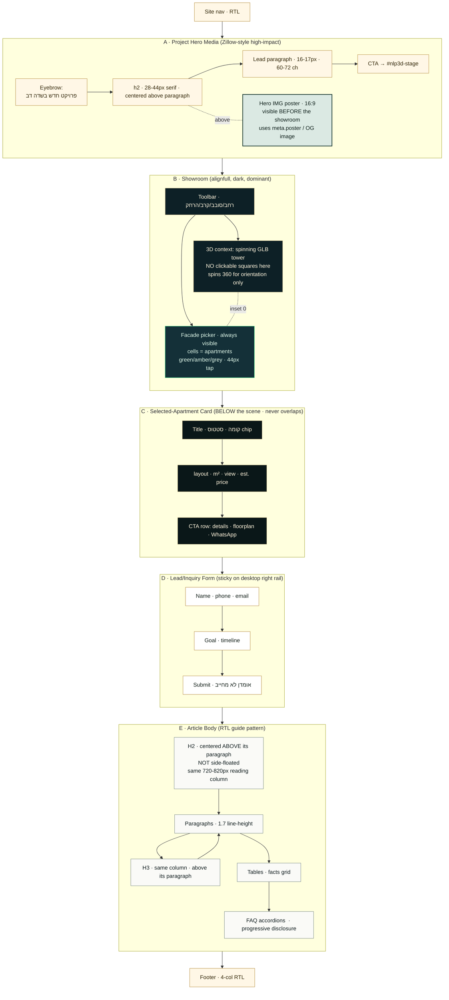
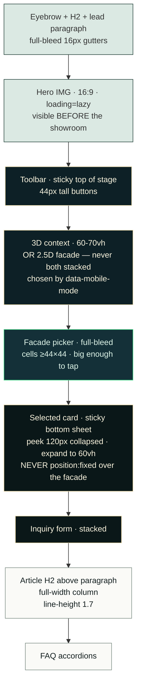
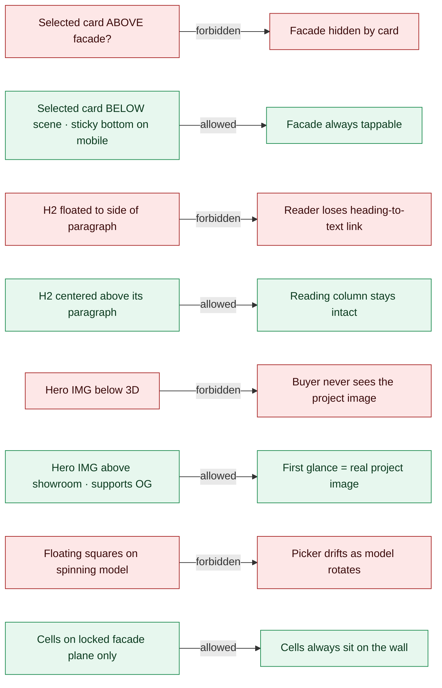

# Rainbow Showroom — Page Layout Contract (v1.67.3)

> **Audience:** every agent (Claude, Codex, future) touching `nadlan_project` pages.
> **Source of truth.** Patches must respect this diagram or update it first.
> **References used:** Zillow 3D Home / interactive floor-plan pattern · Homes.com + Matterport (tour + plan = buyer confidence) · `<model-viewer>` hotspots docs (Google ARCore team) · NN/g progressive disclosure · WCAG 2.5.5 / Apple HIG ≥44 px tap targets · `skills/design-page-patterns.md`, `skills/design-rtl-hebrew.md` §54, `skills/luxury-design-system.md`, `skills/article-guide-design-pattern.md`, `skills/honesty-statement.md`, `skills/skill-release-discipline-and-mistakes.md`.

---

## 1. Desktop (≥761 px) — flow

## 2. Mobile (≤760 px) — stack discipline (no overlap)

## 3. Non-overlap rules (the contract you cannot break)

## 4. Honest scope

- This is a **2.5D** facade selector (cells on a fixed elevation plane). True 360° per-apartment picking on the rotating GLB needs a real BIM/per-apartment mesh — not available yet. The GLB stays as **spinning context**, the picker is the fixed facade. (`skills/honesty-statement.md`.)
- Article H2/H3 are normalised to the article column. Some legacy theme styles tried to "side-float" headings on RTL; we override.
- Mobile uses a **sticky bottom-sheet** for the selected card, not `position: fixed`, so the facade above is never covered.

## 5. Acceptance (gate `v1.67.3`)

- Desktop 1440: hero image visible before showroom · showroom dominant width · selected card sits **below scene**, never covers facade · H2/H3 centered above their paragraph.
- Mobile 390: 3D OR facade visible at a time (no double stack overlap) · selected-card sticky bottom sheet, peek 120 px · all tap targets ≥44 px · no horizontal scroll.
- All six version surfaces aligned at **1.67.3**.
- ZIP 0 backslash, rooted, CRC ok.
- Healthcheck reports `showroom_hierarchy_v1673: true`.
