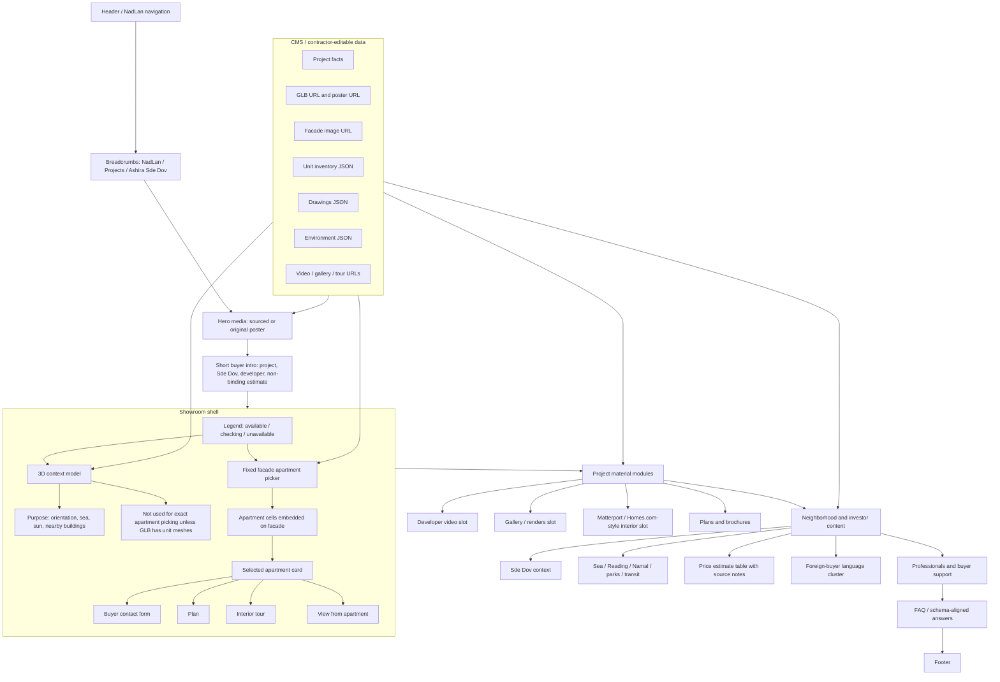
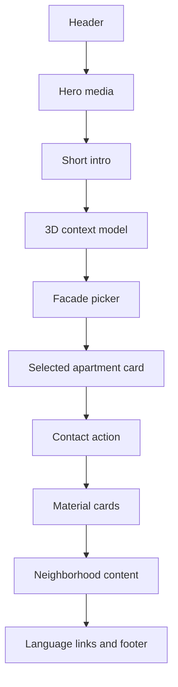

# Ashira Showroom Layout Contract

Date: 2026-06-26

This diagram is the current build contract for the Ashira project page and the repeatable NadLan
project showroom factory.

## Mobile Order

## Realism Rule

The context model must be project-relative:

- Sde Dov projects show land, sea to the west, and nearby references such as Reading / Namal.
- Ramat Aviv projects show Ramat Aviv parks, roads, schools and transit.
- No generic future city. No tower floating in water. No copied developer render without rights.
