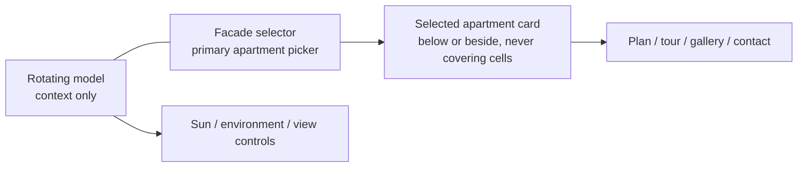
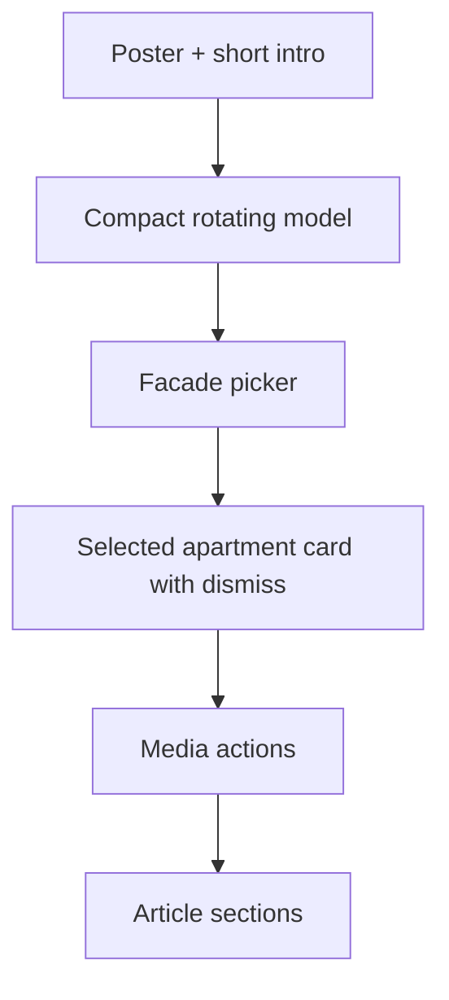

# Ashira Showroom v2 Clean Contract

Date: 2026-06-26
Branch: `codex/ashira-showroom-v2-clean`
Status: contract first, no production code yet

## Honesty Statement

The previous path repeated the same failure mode: more layout and CSS patches were stacked onto an already layered showroom. That is not a stable product foundation. The next Ashira implementation must be a clean v2 surface with one layout contract, one data contract, and one QA gate. If a change requires patching old selectors to make the new surface work, the change is rejected.

This is achievable because v2 does not promise true per-apartment clicking inside a rotating GLB unless the GLB contains segmented apartment meshes. Until that asset exists, the honest architecture is:

- rotating model = context, location, sun, massing, sea/neighborhood orientation;
- fixed facade/elevation = exact apartment selection;
- selected-apartment card = details, view, interior/tour/media, developer contact.

## Non-Negotiable Stop Rules

1. No new CSS patches against legacy `.nlp3d` or `.nlps` selector stacks for the v2 page.
2. No compatibility layer that keeps old selector systems alive beside v2.
3. No fake fallback facade grid. If the facade image is missing, show a missing-asset state.
4. No public wording such as lead, funnel, CRM, monetization, internal workflow, or SEO.
5. No plugin ZIP for a visual-only page layout change when the child theme can own it.
6. No deployment claim without live screenshots at 1440, 768, and 390.
7. No destructive replacement of an existing facade/model asset without explicit owner approval.

## Ownership Boundary

Theme owns:

- project page hierarchy;
- showroom placement;
- responsive layout CSS;
- article heading/paragraph alignment;
- facade/model visual composition;
- screenshots and visual QA proof.

Plugin owns:

- CPTs and meta fields;
- REST/data validation;
- lead/contact capture;
- model-viewer runtime infrastructure;
- healthcheck;
- reusable data rails only.

Project asset folder owns:

- `showroom-payload.json`;
- model URL or local prototype asset;
- facade/elevation image;
- poster/hero image;
- gallery/video/tour links;
- source notes and data provenance.

## One Root, One Contract

V2 must render under one new root class:

```html
<section class="nlv2-showroom" data-project="ashira-sde-dov">
```

Allowed v2 selectors begin with `.nlv2-`.

Forbidden in new v2 CSS:

- `.nlp3d`
- `.nlps`
- old release/version class names
- `!important` except inside a documented emergency rollback file
- duplicate width rules for the same component
- `position: fixed` inside the showroom
- nested scrollbars inside the product stage
- card overlays that permanently cover the facade or model

## Page Order

The buyer-facing page order is fixed:

1. Compact breadcrumb.
2. Real project poster or hero image.
3. Short intro above the showroom: project, location, developer, non-binding price/availability signal, choose-apartment intent.
4. Showroom stage.
5. Selected-apartment card.
6. Media and decision modules.
7. Structured article and data tables.
8. Contact/developer inquiry.
9. Footer and related project links.

## Showroom Stage

Desktop:



Mobile:



## Facade Selector Rules

1. The facade is the primary apartment picker.
2. Cells must be embedded on a facade/elevation image, not floating in space.
3. Cells should read as apartments: rectangular/polygon inventory surfaces, not anonymous dots.
4. Each cell has at least a 44px touch target on mobile.
5. Status colors:
   - available = green;
   - reserved/checking = amber;
   - sold/unavailable = red or muted;
   - recommended available units may pulse lightly.
6. Sold/unavailable cells must not invite purchase, but may explain status.
7. Selected state must remain visible after tap.
8. Details live in the selected-apartment card, not in a popup that blocks the facade.
9. The card must have a dismiss button.
10. If no real facade asset exists, v2 shows a visible missing-facade state and does not render fake inventory.

## Rotating Model Rules

1. The model shows the project in its environment: sea/coast/Reading/nearby projects for Sde Dov; each future project gets its own local context.
2. Orbit is horizontal and product-like. The camera must not expose the underside as the default experience.
3. Spin is slow and stable. Auto-rotate must pause on user interaction.
4. GLB is not used for exact apartment selection unless it has named apartment meshes or validated hotspot surfaces.
5. If segmented BIM/GLB is supplied later, the architecture can switch apartment picking from facade to model without changing the rest of the page contract.

## Selected-Apartment Card

The card must show:

- unit label;
- floor;
- rooms;
- sqm;
- view/orientation;
- status;
- non-binding price estimate or `by inquiry`;
- plan/tour/view/gallery actions when available;
- contact developer action with selected unit context.

The card must not:

- cover the facade permanently;
- collapse the model stage;
- introduce internal business language;
- appear before a unit is selected unless it is a compact instruction state.

## Content And SEO Layer

The article layer must be structured, not a wall of text:

1. One visible H1.
2. H2/H3 headings in the same reading column as paragraphs.
3. Tables for hard facts where possible.
4. Short source notes and dates for estimates.
5. Language pages can be separate pages at first, but each must have its own language-specific SERP research and no URL conflict.
6. Public Hebrew/non-ASCII slugs are forbidden.

## CMS And Contractor Editing

The contractor-facing fields must be reusable:

- project name;
- developer;
- location;
- poster image;
- model URL;
- facade image;
- unit JSON;
- gallery images;
- video URL;
- tour URL;
- drawings/plans JSON;
- environment JSON;
- contact phone/WhatsApp/email;
- legal/source notes.

The owner manual must explain where these live in WordPress and how to replace prototype assets with official material.

## QA Gate

Before any v2 implementation is called ready:

1. Capture real screenshots at 1440, 768, 390.
2. Confirm no horizontal overflow.
3. Confirm model and facade are both visible and close enough to understand together.
4. Confirm selecting a facade cell opens a readable card and does not cover the picker.
5. Confirm mobile order is intro, model, facade, card, article.
6. Confirm one visible H1.
7. Confirm article headings align with paragraphs.
8. Confirm no internal public words.
9. Confirm no old selector surfaces are visible beside v2.
10. Confirm grep on v2 CSS finds no `.nlp3d` or `.nlps` selectors.

Suggested local checks:

```powershell
Select-String -Path <v2-css-file> -Pattern '\.nlp3d|\.nlps|!important'
```

This command should return nothing unless the exception is explicitly documented in the PR.

## Implementation Sequence

1. Contract PR: this document only. No code, no deploy.
2. Clean v2 scaffold: new theme pattern/CSS/JS under `.nlv2-*`, local preview only.
3. Ashira payload: project data, poster/facade/model references, source notes.
4. Screenshot QA: 1440/768/390 before any merge.
5. WordPress draft integration.
6. Live deploy only after screenshots pass.
7. Owner manual and reusable runbook update.

## Why This Solves The Stacking Problem

The old stack failed because every visual issue was treated as another override. V2 changes the method: no old selectors, no layered fallbacks, no duplicated width rules, and no hidden legacy picker. If the clean v2 surface fails, we fix the v2 source, not by writing another override on top of a previous override.
