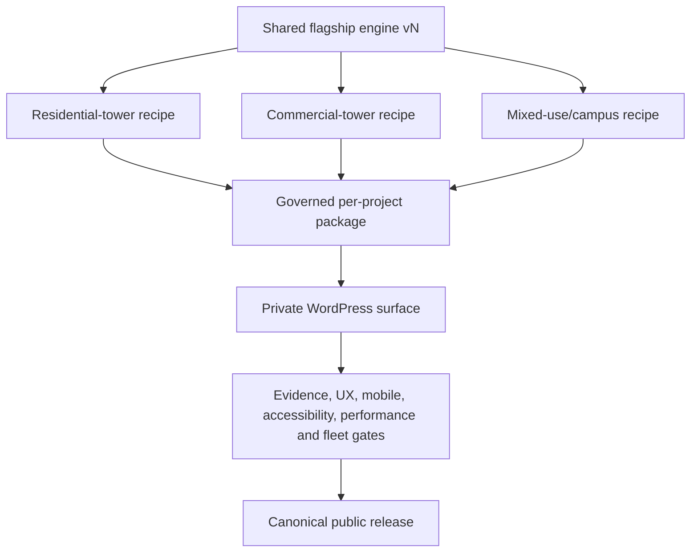

# Einstein-derived flagship recipe draft

Status: Einstein-derived repository playbook. The maintained Codex skill
`nadlan-flagship-project-showroom` now implements this operating model; this folder keeps the full
repository-specific architecture and acceptance detail.

## Proposed operating model

Future flagships should be built as a product family, not as copied project pages:

1. One shared, versioned flagship engine owns rendering, interaction, accessibility, map/beam adapters, lead integration and lifecycle.
2. Each project supplies one governed package: identity, evidence, content, model/LOD/poster, mapping, experiences, inventory state, language manifests and release state.
3. A project-type recipe selects configuration and gates for the archetype - residential tower, multi-building residential campus, commercial tower or mixed-use compound.
4. No project receives a copied PHP/JS/CSS runtime. A project-specific exception must become a reviewed shared capability or remain outside the release.
5. A package can progress from illustration to source-cited mapping to verified inventory/BIM without changing its canonical URL or replacing the engine.

## Active recipe reconciliation

The earlier `skills/recipe-flagship-project-page.md` had three reproducibility defects:

- it delegates to `docs/playbooks/flagship-showroom-recipe.md`, which is absent;
- it points to `docs/playbooks/glb-gen-h-infinity.py`, which is absent;
- it requires a `<1 MB, no normals, uint16` GLB, while Einstein's approved fidelity contract requires at least 30,000 real triangles and the first-party lighting shader depends on normals. Einstein HD is 2,419,992 bytes.

It also said an unknown “stays unknown forever”. The durable rule is now: an unknown stays unknown
until a newer, cited source changes its state through a reviewed replacement record.

The full repository playbook is
[flagship-showroom-recipe-v2-draft.md](flagship-showroom-recipe-v2-draft.md). The applied skill
change and traceability record is [proposed-skill-delta.md](proposed-skill-delta.md). The maintained
agent skill was merged in `The-new-ben/agent-skills` at commit
`e739ae451a9818174f9061a785482a066c2d03ac`; the repository-native entry was reconciled in this
release.

## Einstein lessons promoted into the recipe

- Canonical identity and collision control come before visual production.
- Owner-approved illustration is permitted, but it never becomes decision-grade by repetition or visual polish.
- Exact model coordinates and real-world spatial confidence are different fields.
- High triangle count must represent visible semantic detail; hidden filler fails.
- HD, LOD and poster are separate reviewed assets with hashes and visual gates.
- Three well-separated governed anchors can be better than 52-75 tiny projected dots.
- The model has protected mobile space; visual invitations live below it in normal flow.
- Every visual tool declares its real capability level.
- Zero inventory is a valid product state, not a reason to invent apartments.
- Comments and leads are separate shared adapters with explicit privacy/delivery gates.
- Private WordPress proof is mandatory even when offline and PHP fixtures pass.
- Fleet regression includes H Infinity, Rainbow, Dimri Yama, Ashira, ToHa2 and The Park.
