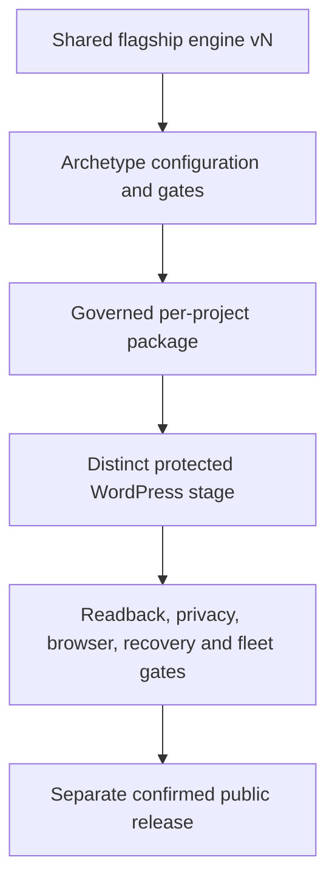

# Einstein-derived flagship recipe v2

Status: implementation-aligned repository playbook and traceability record. This folder describes
the architecture and gates present in the repository at NadLan `main`
`492d9888798a2a82d6f2bd1997e0011540d2ba7f`. It does not authorize a WordPress write, claim an
authenticated private stage, or authorize public release.

The maintained Codex skill `nadlan-flagship-project-showroom` is merged in
`The-new-ben/agent-skills` at `026c84f0d7b32efa1b4fa2ecf94297a407dc831b`.

## Operating model

Future flagships are one product family:

1. One shared, versioned flagship engine owns rendering, interaction, accessibility, map/view
   adapters, private-asset delivery and lifecycle.
2. Each project supplies one governed package containing identity, evidence, content, HD/LOD/poster,
   calibration, mappings, scenes, inventory state, language state and release state.
3. A declared archetype selects required modules and acceptance density. It configures the shared
   engine; it does not fork or copy the runtime.
4. A package can move from illustration to source-cited mapping and later to verified inventory/BIM
   without changing canonical identity or creating a second URL.

## Current implementation map

| Concern | Current repository location |
| --- | --- |
| Current shared PHP composition/privacy | `plugins/nadlan-config/inc/flagship-surface.php` |
| Current shared flagship client files | `plugins/nadlan-config/assets/flagship-v3/` |
| Trusted contract allow-list | `plugins/nadlan-config/assets/flagship-v3/contracts/registry.json` |
| Canonical Einstein data | `data/projects/einstein-tower.json` |
| Governed package | `assets/projects/einstein-tower/contracts/flagship-project.json` plus sibling model, evidence and experience files |
| Protected-stage payload | `docs/wp-drafts/einstein-tower-flagship-v3-private-stage.json` |
| Publication boundary | `docs/plans/einstein-tower-publication-manifest.json` |
| Static validation | `docs/qa/einstein-tower-flagship-stage-validation.json` |
| Comparison and open gates | `docs/qa/einstein-flagship-comparison/` |

Einstein's structure data contains one 28-level residential tower, two 13-level boutique
residential structures and a two-level commercial base. Apply the multi-building residential
campus recipe with mixed-use/public-circulation checks. This archetype decision changes required
data and QA only; it does not create an Einstein runtime.

### Current genericity gap

At `492d988`, archetype is normative documentation and acceptance configuration. There is no
executable `archetype` package key, selector or provider registry. The v3 files are shared by path,
but their current behavior is Einstein-shaped rather than project-neutral: the client layer pins
the Einstein experience decision, four-tool/two-interior/two-facility/three-anchor profile,
`open-frame` scene styling and Hebrew fallback copy; the PHP layer pins current zero-inventory,
North, tool/capability, group/routing and Hebrew-copy policies. These rules support the current
Einstein package; another archetype has not passed the same runtime.

Close the genericity gate only when the trusted registry/package supplies every project-specific
decision and profile value, the same unchanged runtime accepts Einstein and a second package with
different valid IDs/cardinalities/archetype requirements, cross-project mismatches fail closed, and
a shared-runtime scan finds no project-specific identifier, scene/style hook, copy or fixed policy.

## Frozen Einstein reference facts

| Fact | Current value |
| --- | --- |
| Contract / canonical | `einstein-tower-6885-32`; post `4867`; slug `einstein-tower`; parcel `6885/32` |
| Release state | `private_stage`; `public_release_enabled=false`; zero supplied inventory |
| Repository plugin artifact | `1.72.206` (repository state only, not installation proof) |
| HD model | 2,420,492 bytes; 39,912 triangles; 79,824 vertices; 13 meshes; 13 nodes; 10 materials |
| HD SHA-256 | `71fcca8a0f58743b5f2257684c79957fbbff8e0169f5438bdc78231f27968a53` |
| LOD model | 32,244 bytes; 156 triangles; 312 vertices; 9 meshes; 9 nodes; 10 materials |
| LOD SHA-256 | `485161974b6d343956d249d821c893b72a59678e8e8ee2810c90cee5f23079ce` |
| Poster | 23,996 bytes; SHA-256 `5588d09e28f95ac5d6655626027c3ad41f17c5c5c78153ecb2ba138821aa8c85` |
| Mapping cardinality | Exactly 3 governed illustrative anchors serving exactly 4 selectable scenes |
| Mapping truth | Owner-approved illustration; `decision_grade=false`; real-world orientation not calibrated |

The static stage validator reports these repository contracts as internally consistent. The
publication manifest still requires a distinct protected stage, authenticated readback, responsive
browser gates, a before snapshot and rollback artifact. None of those open gates is converted into
a live success claim here.

One current metadata label is not capability proof: the publication manifest's
`private_stage_payload_pending_final_build` detail is stale because the payload exists and passes
its local validator. The payload operation `create_exact_private_sandbox` and guarded Einstein
driver are create-only and abort on an existing exact slug; neither proves a WordPress run or
authorizes replacement.

## Privacy and recovery baseline

Repository version `1.72.206` defines rejected private-asset requests as identical terminal 404s:
no redirect, zero-byte body, `Content-Length: 0`, private no-store/no-cache, noindex/nofollow/
noarchive, `nosniff` and no-referrer. Anonymous WordPress discovery surfaces must remain
non-enumerable, while authorized responses may stream only exact allow-listed bytes and remain
private/no-store.

The guarded release rail must also enforce exact action mode, run-owned storage outside the core
upgrade workspace, measured or bounded-unmeasured capacity, pre-install revalidation, exact page
and raw-meta snapshots, response-loss readback, page-first rollback, same-run lock cleanup and the
documented exact already-original adoption path. These are gates, not evidence that a deployment
ran.

## Documents

- [Flagship showroom recipe v2](flagship-showroom-recipe-v2.md)
- [Merged skill traceability](skill-traceability.md)

## Roadmap boundary

A future split into separate project repositories may be evaluated after the owner approves shared
engine versioning, package interfaces, security ownership, CI/release orchestration and migration.
Until then, the current architecture is one repository, one shared engine and governed per-project
packages. No separate repository is part of this implementation.
