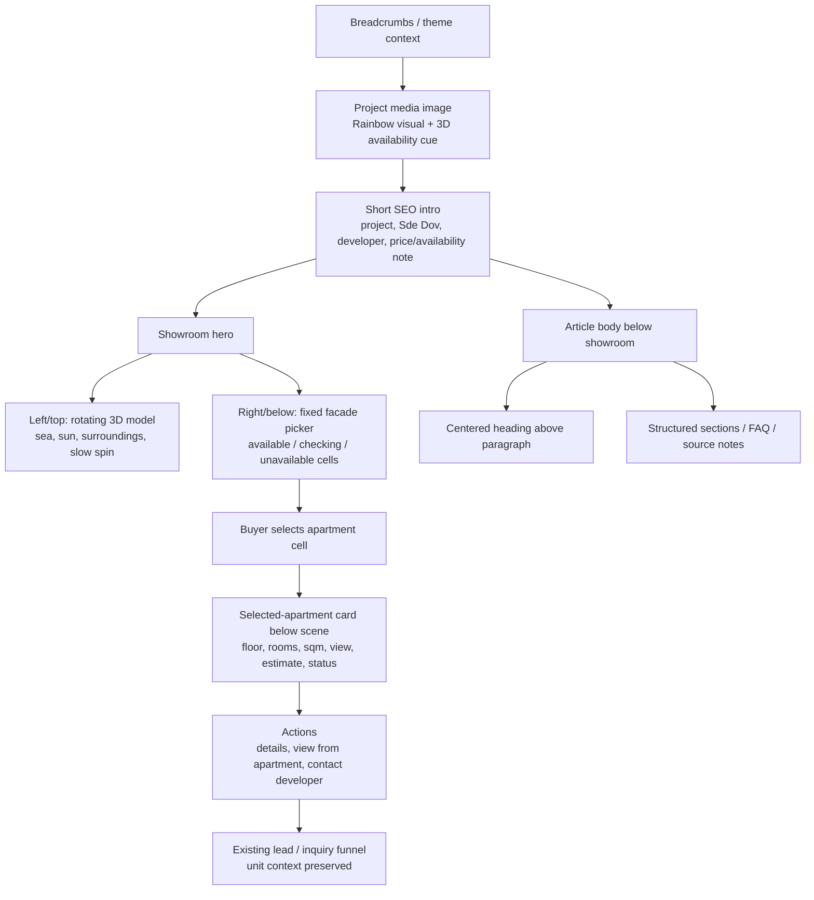

# Rainbow showroom hierarchy v1.67.0

## Decision

This release treats the Rainbow page as a buyer showroom, not as a technical 3D demo.

- The rotating GLB/model-viewer is the context object: sea, sun, surrounding massing and project presence.
- The fixed facade/elevation beside it is the apartment picker: cells are the inventory surface.
- The selected-apartment card docks below the scene, so it cannot cover the model or the facade.
- The project media image appears above the showroom and before the short SEO intro.
- Article headings and paragraphs share one centered reading column below the product.

Claude's diagnosis was partially useful but stale. The server-clean warning was no longer current for this cycle; live had already been restored to 1.66.9 before this work began. The useful part was the hierarchy warning: a buyer should see the showroom first and then read structured content.

## Reference patterns used

- Zillow 3D Home floor plans: https://www.zillow.com/3d-home/floor-plans/
  - Takeaway: the user needs an immersive view plus a clear spatial selector, not a lone 3D object.
- Homes.com Matterport: https://www.homes.com/solutions/matterport
  - Takeaway: tour and floor-plan context belong together so the buyer can understand the product quickly.
- model-viewer annotations: https://modelviewer.dev/examples/annotations
  - Takeaway: hotspots are supported, but floating model hotspots are not the correct primary selector until the GLB contains real apartment meshes.
- NN/g progressive disclosure: https://www.nngroup.com/articles/progressive-disclosure/
  - Takeaway: show the main task first and move secondary controls/details after selection.

## Target layout

## QA gates

- Desktop 1440: model and facade are side-by-side, no floating model squares, selected card does not overlap either surface.
- Tablet 768: model stacks above facade inside the same scene, selected card is below the scene.
- Mobile 390 and Edge-mobile UA: no horizontal overflow, facade remains visible after apartment selection, selected card is not fixed over the model.
- Article typography: H2/H3 headings share the same reading column as the paragraphs and are not pushed sideways.
- Live proof: `/wp-json/nadlan/v1/healthcheck` reports version 1.67.0 and `project_3d.showroom_hierarchy_v1670` is true.

