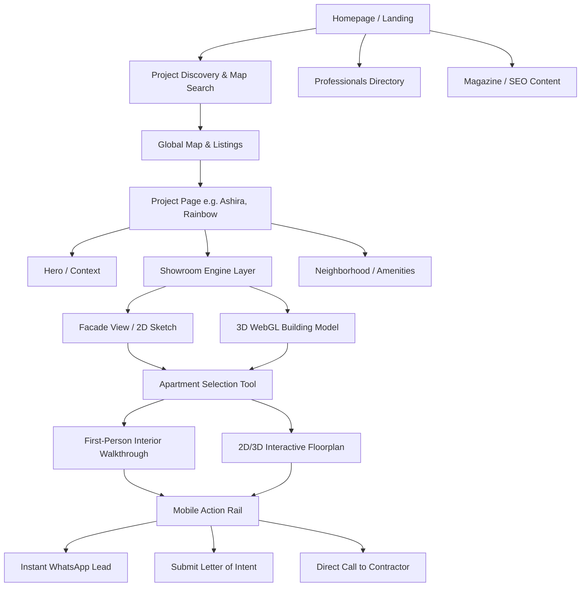
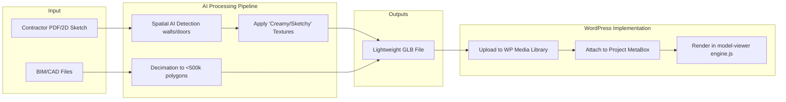

# Platform Architecture & Design Flow

## 1. Site Hierarchy & Ecosystem Pillars
This diagram shows the complete structure of the NadLan platform, from the homepage down to the deep e-commerce layers where users interact with 3D models and contact contractors.

## 2. The Design Flow (From Sketch to 3D)
This diagram illustrates how a raw 2D architectural sketch provided by a contractor is processed into the immersive "Creamy, Sketchy, Architectural" 3D experience on the platform.

## 3. The Design Language Matrix
Every element on the site must adhere to this matrix. No exceptions.

| Element | Specification | Purpose |
| :--- | :--- | :--- |
| **Colors** | Warm Cream `#faf7f1`, Deep Charcoal `#1c1a15`, Terracotta `#c2563a` | Evoke Jerusalem stone, Mediterranean warmth, and high-fashion editorial clarity. |
| **Typography** | Sans-serif for UI (`Inter` or similar), Serif for headers. | Legibility for HNWIs; professional trust signals. |
| **Imagery** | 3D Renders blended with pencil-sketch edges. | Feels bespoke, architectural, and premium rather than mass-produced. |
| **Maps** | Custom Mapbox styles (light-v11) with 3D extrusions. | Contextualizes luxury assets within their geographic reality. |
