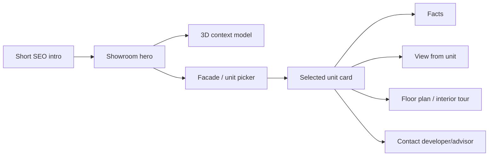
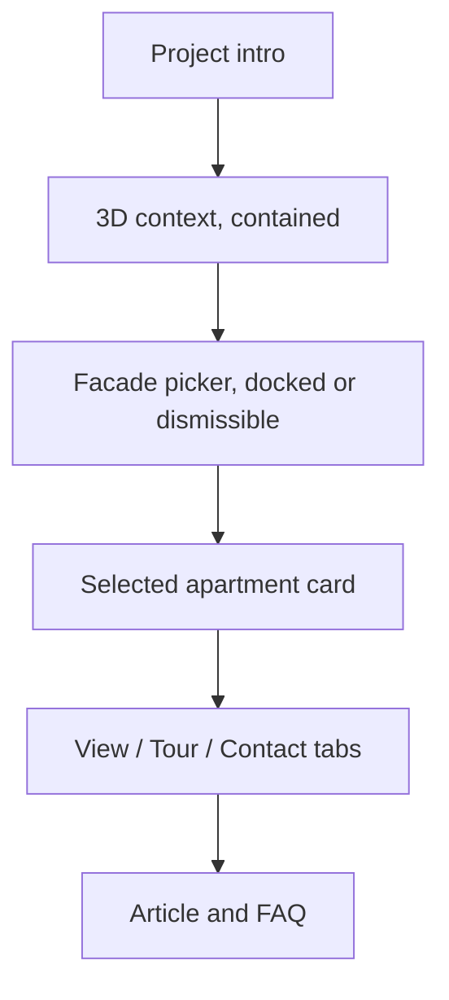

# Project Showroom 3D Build Spec

Purpose: define a reusable project showroom engine for Rainbow, Dimri, and future projects without fake facades or stacked fallback UI.

## Product Goal

Each project page should feel like a digital sales center:

1. Buyer sees the project and environment.
2. Buyer can choose an available unit.
3. Buyer can inspect facts, view, floor plan, interior tour, price estimate, and contact.
4. Contractor/developer can update project materials through CMS/data files.
5. Missing official material is shown honestly.

## Architecture States

| State | Meaning | UI |
|---|---|---|
| `official` | official developer/BIM/elevation/floor plan | label "חומר רשמי מהיזם" |
| `concept` | generated/internal visualization | label "הדמיה מקורית להמחשה - לא חומר רשמי" |
| `missing` | no credible asset | visible missing-state panel |
| `error` | asset exists but failed | visible failure state, no silent fallback |

No silent fallback. No fake grid. No old CSS tower pretending to be real architecture.

## Buyer Experience

Desktop target:

Mobile target:

## Components

### 3D Context Model

Purpose: orientation and wow, not apartment picking unless real per-unit mesh exists.

Rules:
- Lock camera to building-logical movement. Do not show underside by default.
- Horizontal spin/orbit only unless per-project config says free orbit.
- Mark sea/park/context labels when available.
- If GLB missing, show missing/concept state.
- If GLB errors, show visible error.

### Facade / Unit Picker

Purpose: the main apartment selection surface.

Rules:
- Use real elevation/render/photo/concept bitmap.
- Trace polygons/click zones over actual apartment positions.
- Color status: available, reserved, sold/unavailable, high demand.
- Cells can show compact label: floor, unit code, rooms or status.
- Tap/click opens unit card.
- Must support compound: multiple buildings/towers/facades.
- Must be dismissible on mobile and recoverable.
- Must not overflow or cover the 3D model.

### Selected Unit Card

Required:
- unit label.
- floor/building.
- rooms, sqm, balcony if available.
- view/orientation.
- status.
- price estimate with "אומדן לא מחייב" if not official.
- CTA: details, view, interior tour, contact.
- dismiss button.

### View From Apartment

Tiers:
1. Mapbox/terrain/heading estimate.
2. static view image.
3. panoramic/360 view.
4. official view render.

Never show a working-looking button if no data exists.

### Interior Tour

Tiers:
1. official Matterport/Zillow-style iframe/link.
2. generated conceptual room tour labeled concept.
3. floor plan with room labels.
4. missing-state.

Reference patterns:
- Homes.com Matterport: digital twin plus floor plans.
- Zillow 3D Home: interactive floor plans/tours, shareable listing media.
- Matterport: interior digital twin expectation.

## Contractor/CMS Fields

Minimum:
- `project_model_glb`
- `project_model_poster`
- `project_3d_facade_images`
- `project_3d_units`
- `project_floor_plans`
- `project_interior_tours`
- `project_view_assets`
- `project_site_plan`
- `project_contact_phone`
- `project_whatsapp`
- `project_price_range`
- `project_asset_state`: official/concept/missing

## Data File Pattern

Project source data belongs in:

`assets/projects/<project-slug>/showroom-payload.json`

It should validate against the schema and include:
- project facts.
- towers/buildings.
- unit list.
- asset URLs and asset states.
- lead/contact config.
- disclaimers.

## QA Gate

For every showroom change:
- screenshots 1440/768/390.
- console errors.
- horizontal overflow check.
- click 3 units.
- selected card visible and dismissible.
- map/tour buttons either work or show honest missing state.
- lead payload includes project + unit.
- live healthcheck after plugin deploy if plugin touched.

## Definition Of Done

The buyer can pick an apartment without confusion, see credible information, and contact with unit context. The contractor can see where official materials will be loaded later. The page never lies about missing assets.
