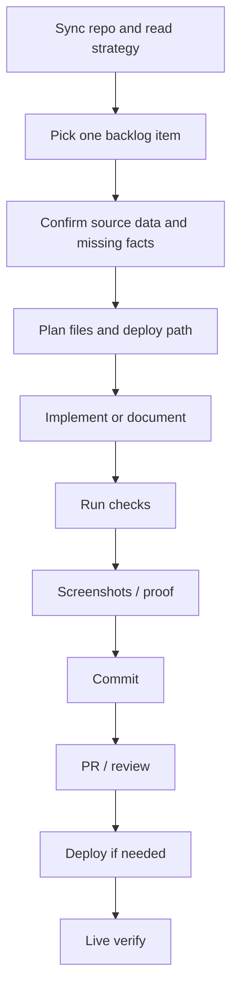

# Agent Execution OS

Purpose: stop drift. This is the working method for Codex, Claude, Lovable, and any future agent.

## Source Of Truth Order

1. `strategy/README.md`
2. `strategy/00-source-registry.md`
3. `strategy/01-gap-audit.md`
4. `strategy/02-keyword-serp-master.csv`
5. `strategy/04-canonical-page-registry.csv`
6. relevant strategy spec/backlog file
7. `COORDINATION.md`
8. repo skills and QA docs

If something exists only in chat, Lovable memory, browser tabs, or local downloads, it is not source of truth until copied into repo.

## Operating Loop



## Step Transition Rule

Before moving to the next implementation/QA/deploy step, check:
- blocker?
- uncertainty?
- missing credential?
- API/tool issue?
- build failure?
- deployment risk?
- unclear architecture?

If yes, write an escalation in this format:

```md
SUPERVISOR ESCALATION
- Attempted:
- Exact blocker:
- Evidence:
- Options:
- Recommended next action:
- Needed to unblock:
```

If no blocker, proceed and log evidence.

## Agent Roles

Codex:
- implements code/docs.
- captures Chrome screenshots.
- writes proof into repo.
- does not claim "done" without check output.

Claude/reviewer:
- reviews/gates.
- merges after proof.
- writes specs when needed.

Owner:
- deploys when no safe automated deploy exists.
- provides official assets/legal approvals.

Lovable:
- visual sandbox only unless exported and committed.

## No-Drift Rules

- One branch per slice.
- No product code in strategy reset branches.
- No hidden temp work.
- No screenshots only in chat.
- No fake facade/listing/tool.
- No silent fallback.
- No baseline screenshot presented as proof of fix.
- No "merged" called "deployed."

## Prompt Families

Use these when starting a subtask:

- A0 - Source registry update.
- A1 - SERP reverse engineering.
- A2 - Canonical page mapping.
- A3 - Homepage design board.
- A4 - Listings UX spec.
- A5 - Project showroom spec.
- A6 - CRM/lead routing.
- A7 - I18N page plan.
- A8 - QA gate.
- A9 - Release/deploy plan.

## Acceptance Criteria For Agent Work

- Files changed are in the declared scope.
- Checks listed in the relevant spec are run.
- Output includes risks and what remains.
- Any missing asset/data is marked with official/concept/missing state.
- PR or commit message names deploy path: THEME, PLUGIN, NONE, CONTENT.
